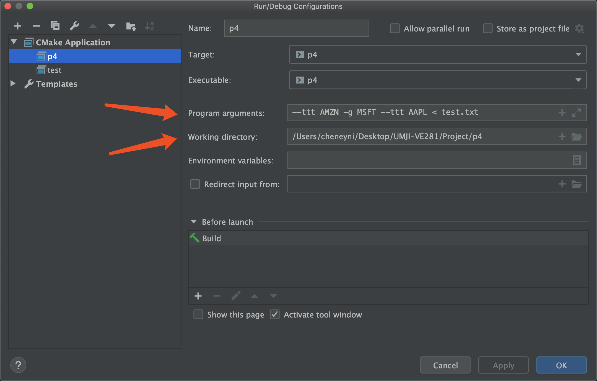

# Program Arguments

## Usage

* You call your program **from your terminal** like: 

```bash
./myprogram arg1 arg2 arg3		# Here ./ means current directory
diff file1 file2
rm file
```

* Why program arguments (not reading from input)?
  * Options are recommended to be passed as program arguments, while data are more recommended to be passed as  standard input or files
  * When typing commands in terminal, there may be autocompletion (press `tab`): lower the risks of typo
  * Single commands can compose larger shell scripts

> **Multiple commands in one line**
>
> ```bash
> g++ test.cpp -o test && ./test		# Run immediately after compilation
> ```

> **Simplest Shell Script** (Linux or OSX)
>
> * Create a file ended with ".sh": `touch test.sh`
> * Edit the shell script:
>
> ```
> #!/bin/bash
> clear                 # Clear the screen
> echo "Hello World"    # Greeting :)
> ```
>
> * Chang the permission of this file:
>
> ```bash
> chmod +x ./test.sh
> ```
>
> * Run the script: `./test.sh`

## Parsing Aruguments

* int main(int argc, char *argv[])
  * argc: Argument count (the count of words seperated by whitespace in one command)
  * argv: Argument vector/values

* All arguments passed to `main` in C/C++ are **C-strings**(char *argv[]))
  * Because `string` is a class provided in C++, but not a primitive data type
* You may need to do type conversion before you want to use the arguments, and throw exceptions when arugments are not as expected.

## Advanced Parsing

* Search for `getopt` or `getopt_long`, these are ways of analyzing a bunch of program arguments as **options**.
* Used in VE281. May not be allowed in VE280 (or not necessary)

## Args in CLion

* You can use the terminal in CLion. This evokes your system terminal.


* Or you can directly add program arguments to the run configurations. Then each time you press the triangle to run, there will be your program arguments.




* Each run configuration can only has one set of fixed program arguments. You can add more configurations to store some frequently used program arguments (such as for debugging).


> Working Directory: Clion allows you to change the working directory of your program. If you don't specify, the working directory will be `cmake-build-debug` instead of where your source file is. If you want to use CLion build as you are compiling in the terminal, you need to specify this.
>
> 
>
> If you run the program in terminal, then the working directory is the **current directory **(where you run the program, not where the source file or program is).
>
> ```cpp
> #include <iostream>
> #include <fstream>
> using namespace std;
> 
> int main (int argc, char *argv[]) {
>   	// Here since relative path is used, the program will 
>   	// only open text.txt in working directory.
> 		ifstream inFile("text.txt");
>   	string s;
>   	inFile >> s;
>   	cout << s << endl;
> 		return 0;
> }
> ```
>
> 

## Credit

SU2019 & SU2020 VE280 Teaching Groups.

VE280 Lecture 9