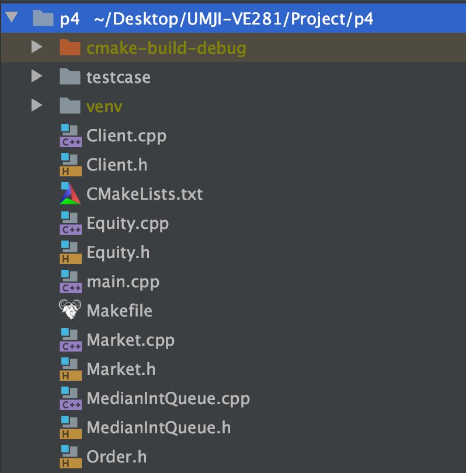

# Abstract Data Type

🌶💩💉💦🤡🐘

## Types in Programming

**Type** is a rather abstract concept. It can be defined independently of any programming languages. A type is always defined in two aspects:

* The set of values that can be represented by items of the type

* The set of operations that can be performed on items of the type.

For example, `int` in cpp actually refers to signed integers, which supports basic arithmetic operations.

## struct in C++

* `struct` in C:
  * Provide a way to define complex data type
  * Simply organize data of different types together for simplicity and easier management
  * No inheritance. No polymorphism. No member functions. No access control (public, private, protected).

* `struct` in C++:
  * Enhanced version of C struct
  * All member variables/functions are public (no access control)
  * Support member function, function overloading, constructor/destructor, inheritance
  * However, it is still recommended to use `class` for complex types and behaviors. `struct` is more suitable for simple types defination. 

## Abstract Data Type

ADTs provide an **abstract** **description** of **values** and **operations**. In short, to define an ADT, we only need to know:

* What values it represents: a mobile phone that can make and receive calls
* What can it do to these values (operations): turn on/off, make/receive call, text message, play games...

ADTs provide two advantages:

* Information hiding: We don't need to know the details (how messages travel across the air to reach our phone?)
* Encapsulation: the objects and their operations are defined in the same place (You don't need to buy the screen, the circuit board, the wifi module...You just buy a phone)

ADTs has several benefits:

* **local**: the implementation of other components of the program does not depend on the implementation of ADT (5G base stations don't care how the phones will process the signals)
* **substitutable**: you can change the implementation and no users of that type can tell (iPhone, Huawei, Xiaomi can all make phone calls, but their hardwares/softwares are not the same)

ADTs are implemented with `class` in C++.

> ⚠️ Attention: The definition of ADTs itself has no relation with C++. C++ `class` is only one way to implement ADTs.

## C++ class

For basic knowledges you can refer to: [VG101-Final](https://github.com/nichujie/UMJI-VE280-FA2020/blob/master/RC/vg101-final.pdf)

### Defination & Declaration

#### Seperated files

Typically, we write only the declarations of a class in header files (.h/.hpp) and definitions in source files (.cpp). Header files and source files always appear in pairs. They are always named with class names. Each file describes only one class (Not forced in C++ but in Java).



#### Detail Hiding


When you want to use a library written by others (or cpp standard libraries), it is very likely that you will only get header files (.h/.hpp) and some static libraries (.a/.lib) or dymamic libraries(.so/.dll). The detailed implementation of these libraries are hidden, and you only need to read the documentations to learn how to use them.

However, writing function definations in header files do has its advantages. For functions defined in header files, it will be compiled as almost inline functions to improve performance.

### Getters & Setters

These are two concepts widely used in OOP programming. Typically, getters & setters refer to those **member functions used to get or modify private members**. These methods allow outer codes to access certain attributes of the class. 

Also, using getters/setters allows you to add extra operations when getting/modifying values. For example, validating the values when modifying an attribute:

```cpp
class Student {
    int    score;
  public:
    // A getter of score, qualified as const
    int    getScore() const {return this->score;};
  
    // A setter of score. New scores lower than 0 is regarded as illegal.
    void   setScore(int newScore) {
      if (newScore < 0) {
        cout << "How is that possible?" << endl;
        return;
      }
      this->score = newScore;
    };
};
```

This validation cannot be done by directly assigning values.

## Representation Invariant

—This invariant is a rule that the representation must obey both **immediately before** and **immediately after** any method's execution. In simpler language:

* An ADT must still be legal no matter how your customer use it
* This is achieved by carefully writing each methods
* **"immediately before"** guarantees your following operations can be done correctly (if you are given a set like {1,1,2,2,3}, then even if you write the method `remove()` correctly, the result will not be correct)
* **"immediately after"** guarantees your operations by far are legal. This ensures that further operations can be done correctly.

## More on C++ class

### Initialization List

```cpp
ClsName::ClsName() : base(..), m1(..), m2(..) {
       // Code for the some other operations need to be done during construction
}
```

* The order of initialization **is the order they are defined in the class**
* The performance (both time and memory) can be better than assigning to each values.
* A member that don’t have a default constructor must be initialized in the initialization list.
* const members and references can only be initialized in the initialization list.

### const Member Functions

* A `const` qualifier after **member functions** promises that this member function will not modify this object. 

```cpp
class Sample {
    int val;
public:
    void setVal() const { val = 0; }	// Compile error
};
```

* Also, inside a `const` member function, non-const member functions (as well as other functions that may modify the object) cannot be called (to ensure that the object will not be modified).

```cpp
void ordinary_func (int &d) {
    d = 666;
}

class Sample {
public:
    int a;
    int b;
public:
    int getA() const { return a; };
    int getB() { return b; }
    void setVal() const { 
        int tmp1 = getA();
        int tmp2 = getB();  // not OK, getB() should be qualified as const
        ordinary_func(a);   
      	// not OK, "a" is automatically cast into "const int" 
      	// in this member function
    }
};
```

* This qualifer tells the compiler to check. It protects the object by casting all member variabales into `const`, as well as `this`.

## Suggestion

Look deep into the slides, especially the IntSet example. 

## Credit

SU2019 & SU2020 VE280 Teaching Groups.

VE280 Lecture 13