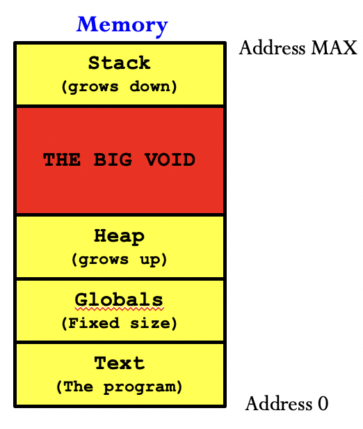

# Dynamic Memory Allocation & Destructor

@Chujie Ni

### Memory Management



There are basically three types of variables in C++ programs:

* Global Variables
  * Defined outside functions
  * Lifetime: Their space is set aside **before** the programs runs (at compile time), and is reserved **until** the program terminates.
* Local Variables
  * Defined within a block (basically insides curly brackets {})
  * Lifetime: Space is set aside when relevent block is entered (at run time), and reserved until the block is exited.
* Dynamic Variables
  * Lifetime: Space is allocated using `new`, and deallocated using `delete`. Their existence has nothing to do with pointers. 

> Note: The "Stack" and "Heap" here refers to specific locations in the memory. They are not equivalent to the data structures called "stack" and "heap", though their behavior is similar.

## Play with Memory

### Why dynamic memory?

* Local varibales can only be fixed size, we want to change the size at runtime.

```cpp
int length;
cin >> length;
int arr[length];
```

This code may be compiled successfully with some compilers. However, it is not allowed in  ISO c++ standard. Some compilers allow this as an extension. You can add `-pedantic` flag to turn on the warning.

* We don't know the exact lifetime of the objects.

### Allocation

```cpp
Type* obj0 = new Type; // Default construction
Type* obj1 = new Type(); // Default construction
Type* obj2 = new Type(arg1, arg2); // Constructor with 2 params
Type* objA0 = new Type[size]; // Default cons each elt
Type* objA1 = new Type[size](); // Same as obj A0
```

However, you cannot allocate an array of objects using non-default constructors.

When using `new` and `new[]`, following things happens:

1. Allocates space in heap (for one or an array of objects).
2. Constructs object in-place (mainly be calling **constructor**).
3. Returns the “first” address.

You may remeber `malloc` and `free` in the C language. They only deal with the memory while do nothing to the content in it. That means in C you need to `malloc` the space and initialize it by hand.

### Deallocation

Use `delete` and `delete[]` to deallocate single object and arrays respectively.

## Memory Leak

The usage of `new/delete` is very easy. The difficult point is when and where to use them.

Basically, memory leak happens **when you lose the address of some dynamic memory** (then it would be impossible for you to `delete` that memory).

```cpp
// Each time foo() is called, there is new memory allocated.
// And since p is a local variable, each time p will point to a new address
void foo() {int* p = new int(0); /* Code */}
```

Each time `foo()` is called, some memory is occupied and will not be released even after the program terminates. Gradually, you will drain out all memory of your computer, which is very bad.

You may try to solve the problem by writing:

```cpp
void foo() {int* p = new int(0); /* Code */ delete p;}
```

Or:

```cpp
void foo() {
  int* p = new int(0); 
  try{/* Code */}
  catch(...){
    delete p; throw;
  }
}
```

But this won't solve the problrm thoroughly, since:

* Exception processing will increase program size and reduce performance.
* What if the program return earlier than `delete`?
* Can you really remember and figure out all places to release?

Therefore, **we need a universal pattern (or strategy) to ensure there is no memory leak.**

## [RAII](https://en.cppreference.com/w/cpp/language/raii)

Stands for **Resource Acquisition Is Instantiation,** also known as **Scope-based Resource Management**. This is a C++ programming technique which **binds the life cycle of a resource** that must be acquired before use **to the lifetime of an object**.

In simple words:

* Resource is allocated in constructors and constructors only.
* Resource is released in destructors.
* Object “owns” the resources. The resource is managed by the object and the object only.
* The resources would share it’s life cycle with object. As long as there is no object leak there is no resource leak. Fortunately we know automatic objects are destroyed by the compiler when they go out of scope, impossible to have object leak. 

### Destructors

* Be named as ~ClassName.

* Takes no argument and returns nothing (Not even void).

* <u>If one expect the class to be inherited, the destructor should be declared as virtual.</u>

* Release resource allocated only in this class <u>(don’t release base class resources!).</u>

Destructors are called automatically when exiting a scope, throwing an exception, terminating the program or using `delete`. When destructing an object:

* It calls the destructor of the class.
* Calls the destructors for each member of current class. 
* Calls destructor of the base class.
* Does above **recursively** until no more destructors to invoke. Finally it releases the memory.

### Destructor v.s. Constructor

About virtuality:

* constructor cannot be `virtual`
* If one class is going to be inherited by other classes, its destructor must be `virtual`

About calling time:

* constructor is called when an object is being created (either global, local or dynamic). However, constructors of base classes will not be called unless you explicitly do so.
* destructor is called automatcially when an object reaches the end of its lifetime. Destructors of base classes are then called recursively.

### Dynamic Array of Pointers

```cpp
#include <iostream>
using namespace std;

class TestClass {
private:
    int val;
public:
    TestClass() { cout << "A default constructor" << endl; }
    TestClass(int a): val(a) { cout << "A one-param constructor" << endl; }
    ~TestClass() { cout << "A destructor" << endl; }
};

int main() {
    size_t num = 3;
    
    TestClass* pointer_to_array = new TestClass[num];
    delete[] pointer_to_array;

    TestClass** array_of_pointers = new TestClass*[num];

    for (size_t i = 0; i < num; i++) array_of_pointers[i] = new TestClass(i);

  	// First delete the objects pointing to, then delete the memory for 
    // pointers themselves
    for (size_t i = 0; i < num; i++) delete(array_of_pointers[i]);
    delete[] array_of_pointers;
    return 0;
}
```

This example shows the difference between a dynamic array of values and a dynamic array of pointers. You can compile it and investigate what happens at each step.

**Thinking**: Can the order of `delete` be reversed?

> Note: This style of creating a dynamic array of pointers is not very C++. Usually we would prefer `vector<int*>`, which is an STL container. The code here is only for example.

## Common Issues

* Memory Leak (Remember the virtual mechanism)

```cpp
class Base {
protected:
	int *p;
public:
	Base() : p(new int(10)) {}
	~Base() {delete p;}
};

class Derived : public Base {
	int *q;
public:
	Derived() : Base(), q(new int(20)) {}
	~Derived() {delete q;}
};

// Leak!
void foo() {
	Base* ptrA = new Derived;
	delete ptrA;
}

// Safe
void bar() {
	Derived* ptrB = new Derived;
	delete ptrB;
}
```

* Double Free (Only care about your own resource!)

```cpp
class Base {
protected:
    int *p;
public:
    Base() : p(new int(10)) {}
    virtual ~Base() {delete p;}
};

class Derived : public Base {
    int *q;
public:
    Derived() : Base(), q(new int(20)) {}
    virtual ~Derived() override {delete p; delete q;}
};

// Double Free
void foo() {
	Base* ptrA = new Derived;
	delete ptrA;
}

// Double Free!
void bar() {
	Derived* ptrB = new Derived;
	delete ptrB;
}
```

## Valgrind

` valgrind` is a powerful tool used to check memory issues of your program. Please search online for detail. Commonly, it is used to check:

* Memory Leaks.

* Invalid accesses, array out-of-range, use of freed memory, etc.
* Double free problems.

Note: **Only a good programmer can eliminate memory issues, not valgrind.**

## Credit

SU2019 & SU2020 VE280 Teaching Groups.

VE280 Lecture 17

