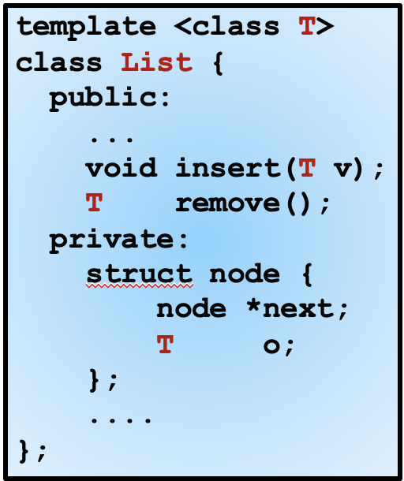
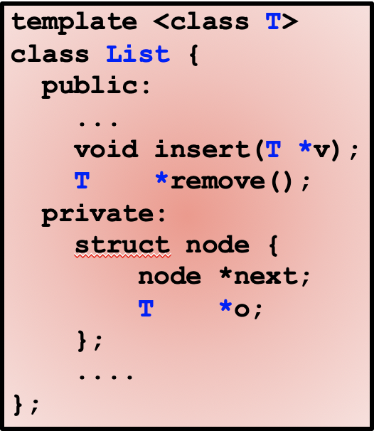

# Template and Container

## Templates

### Template Function

A single function can also be templated to implement generic algorithms.

Note: 

* Using  `class` and `typename` are both fine. `typename` is introduced in C++11, they are basically the same.
* `template <...>` must be written just before the header of the function/class, because they are actually a single declaration statement: `template <typename T> typename T add(const T &num1, const T &num2)`. Usually they are written in two lines for clarity.

```cpp
template <typename T>
typename T add(const T &num1, const T &num2) {
    // For int, double... This will be sum of numerical value
  	// For other objects, you can overload the "+" operator
    return num1 + num2;
}
```

No need to specify type when using:

```cpp
double a = 2.0, b = 3.0;
add(1, 2);
double c = add(a, b);
```

### Template Class

```cpp
template <class T1, class T2, ...> 
class ClassName {
// Defination of class
}
```

* Usually used to write containers (A special kind of class that only holds data, but not do any specific modification to them)
* The typenames will be replaced with specific types when compiling (similar to Macro during preprocess):
  * Therefore, more types you use,  the compiling time will be longer
  * More types you use, the size of final program will be larger
* Definition and declaration are usually written in one header file:
  * C++ will compile each .cpp file into an object file (.o). However, it's meaningless to compile a template without specific types into an object file (similar logic as an abstract class will not have instances).

## Container of Pointers

### Modification of Declaration

Because copying objects (when passed as parameters or assigning) waste a lot of time and memory, we would like to store the addresses only. However, we will not write like this:



This still allows users of this container to declare a container that stores values rather than pointers by writing: `List<BigThing> ls;` In order to eliminate this possibility, we would rather write:



### One Invariant & Three Rules

There are some basic rules to ensure there will be no memory issues:

* **At-most-once invariant**: —any object can be linked to at most one container at any time through pointer.

* **Existence**: An object must be **dynamically allocated** before a pointer to it is inserted.
* **Ownership**: Once a pointer to an object is inserted, that object becomes the property of the container. It can only be modified through the methods of the container. 
* **Conservation**: When a pointer is removed from a container, either the pointer must be inserted into **some** container, or its referent must be **deleted**.

Analogy: Let's compare object to money, compare container to banks.

* **Invariant**: A sum of money can only be held by someone, or some bank, not both.
* **Existence**: You must have some money before you put them into bank. The bank itself cannot generate money.
* **Ownership**: Once your money is put into the bank, you can only go the bank counter or the ATM to manage them.
* **Conservation**: When you take your money out, you can only put it into other banks, or manage by yourself. (Of course you can throw it away if you are rich)

> Suggestion: Go through the slides and understand each example.

### Destroy a templated Container

According to our rules, a container must be responsible for the objects it is holding. If a container is destroyed before the objects in it is deleted, there will be memory leak. Therefore, we should rewrite:

* **The destructor**: Destroys an existing instance.

* **The assignment operator**: Destroys an existing instance before copying the contents of another instance.

## Polymorphic Container

Intuition: A templated container can only hold one type of objects at one time, while we want a container that can hold more.

* Templates are checked at compile time, sometimes called *static polymorphism*.
* The behavior of `virtual` functions can only be determined during runtime, therefore it is called *runtime polymorphism*.

Therefore, we can use the derived class mechanism (a pointer of super class can point to an instance of derived class). We would like to declare a "dummy class" called `Object` and let other classes inherit it.

```cpp
class Object {
public:
  virtual ~Object() { }
};
```

### Dynamic Cast

Inserting objects of derived classes into the container is trivial. However, when you retrieve it from the container and want to use it as a derived class again, you must do some type cast:

```cpp
Object *op;
BigThing *bp;

op = l.remove();
bp = dynamic_cast<BigThing *>(op);  // return a null pointer if cast failed
assert(bp);      // The program will abort if bp is null
// In practical programming, you may write:
if (!bp) {
  // Do something to handle the cast failure
  cout << "Dynamic cast failed !!!" << endl;
	return -1;	// You can assign any error code you like
} else {
  // Continue to do what you like
}
```

> Avoid using this type of cast. Dynamic cast cannot ensure 100% success. Also it will make your code hard to maintain and read.

### The clone() function

As this is also a container of pointers, we also need to rewrite the copy constructor to ensure deep copy when copying the whole container. However, issues come when you try to write code as we written for templated container:

```cpp
void List::copyList(node *list) {
  if(!list) return;
  Object *o;
  copyList(list->next);
  o = new Object(*list->value);    // *list->value is a BigThing object
  insert(o);
}
```

Therefore, we need to use a little technique called **named constructor**: An **ordinary method** that copies the object itself, —returning a pointer to the "generic" base class. Look into slides and understand the sample code.

Why we have to write in this way?

* Because constructor cannot be `virtual`. If you just write constructor for each derived class, it cannot be invoked by `new Object(...)`.
* However, other functions can be `virtual` and overloaded by each derived class. We then alter our strategy. Instead of rewriting constructors, what we really want is just a way to copy an object itself and return a pointer to it.

> Inspiration: Sometimes we need to use some non-language techniques to fix issues.

## NULL and nullptr

We always use `NULL` to represent a null pointer, and in C++ we also have `nullptr` to indicate this. Sometimes we will see such code to check a pointer:

```cpp
int *a = NULL;
if (a == NULL) { ... }    // Make sense
if (!a) { ... }           // OK
if (a == 0) { ... }       // ???
```

Actually, `NULL` is not that mysterious when we look at its definition:

```cpp
#ifdef __cplusplus
#define NULL 0
#else
#define NULL ((void *)0)	// This is the defination in C
#endif
```

Therefore, `NULL` is actually a pointer pointing to **address 0** in C. And in C++, `NULL` is partly equivalent to the numerical value 0. However, sometimes there will be ambiguity and mistakes when `NULL` is mixed with 0. Thus, C++11 introduced `nullptr` to represent a null pointer, and it cannot be cast into a numerical value. Try the following:

```cpp
cout << (NULL == 0) << endl;			// NULL will be cast to 0 in C++
cout << (nullptr == 0) << endl;		// nullptr is of type "nullptr_t", and is not allowed to be cast into int
```

> Note: It is a good habit to check whether a pointer is null before using it, especially when you are debugging. Actually, in some dynamic languages, programmers are required to do such checks.

> Note: In C++, try to use nullptr instead of NULL.

## *Four types of cast in C++

* **dynamic_cast**: Safely converts pointers and references to classes up, down, and sideways along the inheritance hierarchy.
* **reinterpret_cast**: Convert between pointers of any type. It is conducted on binary level. Not very meaningful.
* **const_cast**: Convert a const pointer or reference of an object to a non-const one, which allows you to modify it. If that object is non-const, you can modify it as expected. **If that object is const when declared, the modification will lead to undefined behavior.** See [reference](https://en.cppreference.com/w/cpp/language/const_cast).
* static_cast: Very complicated. Often used for initialization. See [reference](https://en.cppreference.com/w/cpp/language/static_cast).

## Credit

SU2019 & SU2020 VE280 Teaching Groups.

VE280 Lecture 25

