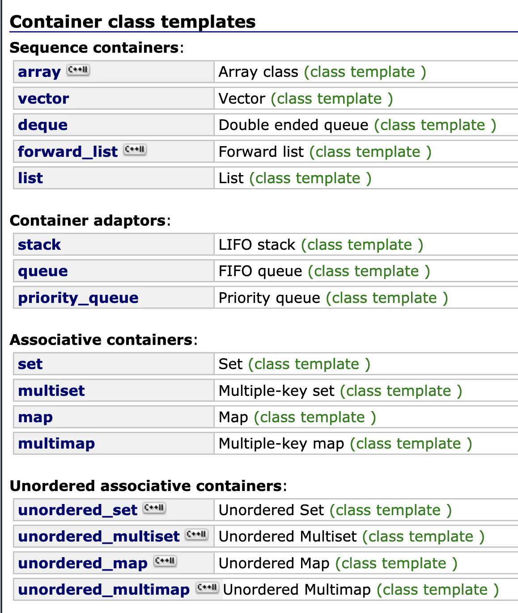

# STL Sequential Container

STL: Something not so allowed in VE280

## Standard Template Library (STL)

Three kind of containers:

* —**Sequential Containers**: let the programmer control the order in which the elements are stored and accessed. The order does not depend on the values of the elements (Before you insert an element, you know exactly where it will go to, though you cannot access it directly)

* —**Associative Containers**: store elements based on their values. The order depends on the value of the elements (You don't know where the element will go to, but you can get it later according to the container's rule)

* —**Container Adapters**: take an existing container type and make it act like a different type

See [reference](http://www.cplusplus.com/reference/stl/) for more.



### Sequential Containers

* vector: —: based on arrays.
* deque (double-ended queue): —: based on arrays.
* list: —based on a doubly-linked lists

## —STL Sequential Container: vector

This container is widely used, therefore introduced in VE280. However, you are not allowed to use it unless stated. You can include and use it by:

```cpp
#include <vector>
using namespace std;

vector<int> i_vec;
vector<BigThing> b_vec;	 // STL containers only store copies of objects
vector<BigThing*> bp_ivec;  // If you want to store pointers, write in this form
```

### Initializing Vector

```cpp
vector<int> v1;      // Empty vector
vector<int> v2(v1);  // Copy v1 to v2
vector<T> v3(n, t);  // A vector has n elements with value t

// Don't do this:
vector<int*> pv1;      // Empty vector that store pointers
vector<int*> pv2(pv1); // Attention: Only the pointer is copies, not the object it points to
// Therefore, there will be two pointers to one object
// Even after you rewrite copy constructor... The result is still the same
```

### size_type

```cpp
vector<int> v;
// The lower line is less preferred
vector<int>::size_type s1 = v.size();  // Perfect
size_t s2 = v.size();  // Fine
unsigned int s3 = v.size();  // OK
int s4 = v.size();  // Not OK
```

Good habit: Check whether the vector is empty before accessing its data:

```cpp
vector<int> v;
if (!v.empty()) { ... }
```

### Add/Remove

```cpp
vector<int> v;
v.push_back(1);    // Push one element to the end
v.emplace_back(2); // Push element to end. More efficient than push_back()
v.pop_back();      // No return value
```

### Subscripting

```cpp
vector<int> v;
v.push_back(1);
cout << v[0] << endl;
cout << v.at(0) << endl;  // A method with same function as []
```

## Iterators

At this time, you don't need to understand what's behind it. You just need to know how to use it. Probably you will not have chance to use it in your own project, however, it may appear in your exam.

Some points:

* `front()` and `back()` return a **reference to element**. `begin()` and `end()` return an **iterator**.
* Add `*` before an iterator let us access the element in it. However, **you shall not view iterator as pointer**.
* `end()` positions at the next position of the last element. Therefore, you shall avoid accessing the content in `end()`.
* When the vector is empty, `begin() == end()`
* Add or subtract from an iterator lead to change of position (`iter+=2`, `iter--`)

For other operations and specific usages, please refer to the reference.

## Other Two Sequential Containers

* deque: double-ended queue. Support insert/remove at the beginning
* list: Similar to a linked list

### Selection of Containers

You should start by evaluating which operations will your program involve, and use the proper STL container to optimize the performance of your program.

Each container has its specialty and advantages (also disadvantages). 

## Credit

SU2019 & SU2020 VE280 Teaching Groups.

VE280 Lecture 25

