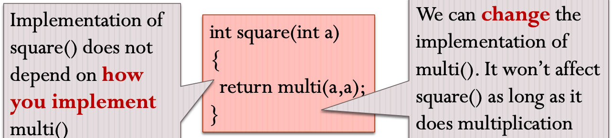
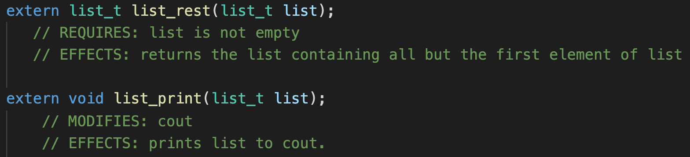
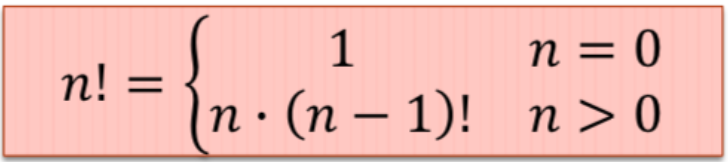
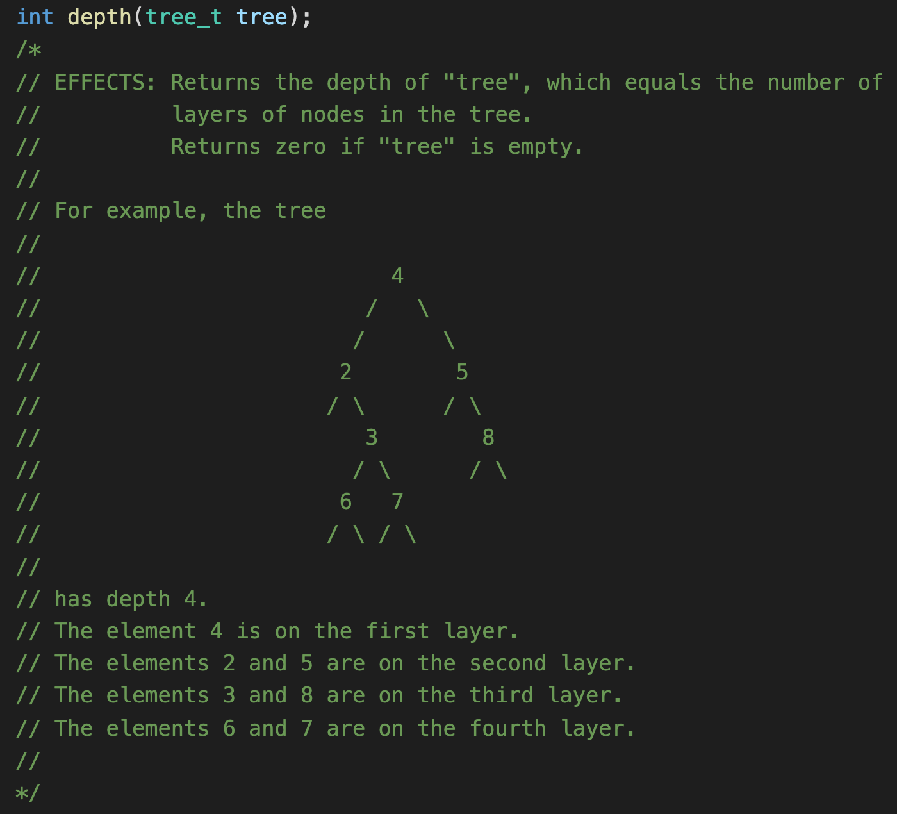
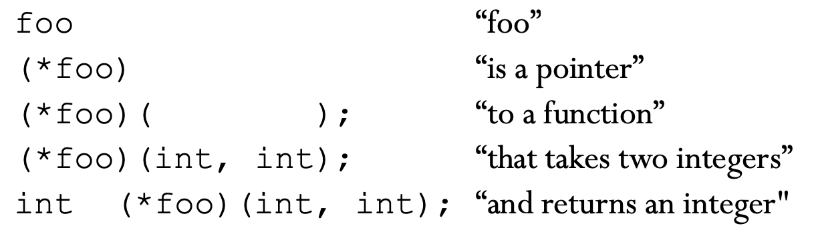
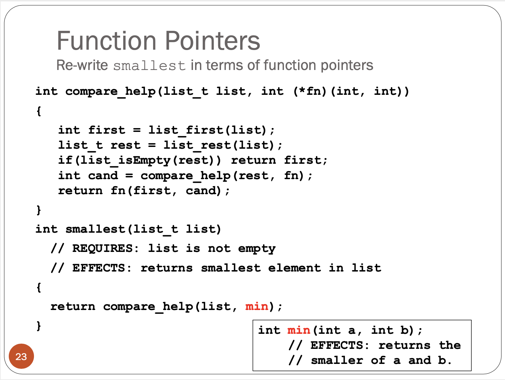
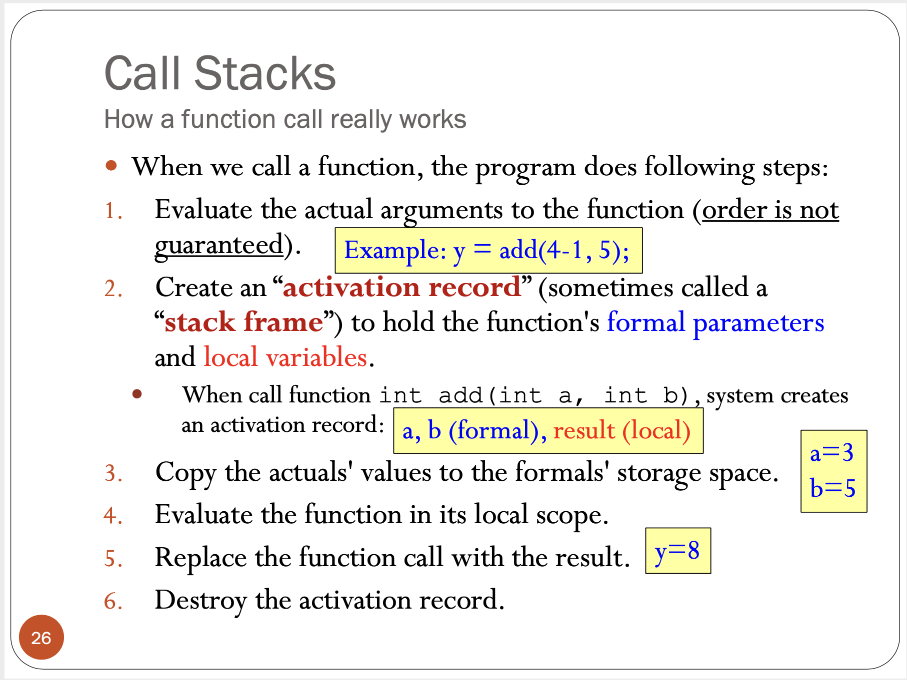

# VE280-Fall-2020 Midterm RC

## 06 Procedural Abstraction

### Concepts & Motivation

Abstraction:

* Provides only those details that matter.
* Eliminates unnecessary details and reduces complexity.

* Only need to know **what** it does, not **how** it does it.

Different roles in programming:

* The author: who **implements** the function
* The client: who **uses** the function

* In individual programming, you are both.
* Example of client: you use `cout` to output, which is written by author of C++. You don't need to worry about how `cout` works.

### Property

#### Local

The implementation of an abstraction does not depend on any other abstraction implementation.

#### Substitutable

You can replace one (correct) implementation of an abstraction with another (correct) one, and no callers of that abstraction will need to be modified.



### Abstraction & Implementation

* Abstraction: tells **what**

* Implementation: tells **how**

* <u>**Same** abstraction could have **different** implementations</u>

### Type Signature

* The type signature of a function can be considered as part of the abstraction.

* Type signature includes **return type, number of arguments and the type of each argument.**
* Type signature does not include the name of the function.
* Type signature is also known as **function prototype**.

For example:

```c++
int a;
int b;
bool retVal = (*fPtr)(a, b);
```

Then the function pointer `fPtr` has the signature:

```c++
(bool) (int, int);
// You may declare fPtr as: bool (*fPtr)(int, int)
```

Suppose we now have function:

```cpp
bool greaterThan(int a, int b) { return a > b; }
bool lowerThan(int a, int b) { return a < b; }
```

We can assign both functions to `fPtr`, and the above code can run well.

### Specifications

Used to the describe abstraction (not implementation).

> How to describe implementation: natrual language / pseudo code / real code

There are mainly three clauses to the specification:

* **REQUIRES**: the pre-conditions that must hold, if any.
* **MODIFIES**: how inputs are modified, if any.
* **EFFECTS**: what the procedure computes given legal inputs.

Functions without REQUIRES clauses are considered **complete**; they are valid for all input. Functions with REQUIRES clauses are considered partial.

> Note: Specifications are just comments. You cannot really prevent clients from doing stupid things, unless you use exception handling. While in VE280, you can always assume the input is valid if there is a REQUIRES comment.



> Think: why is cout modified? (not so important, just for understanding)
>
> Hint: http://www.cplusplus.com/reference/ostream/ostream/operator%3C%3C/

## 07 Recursion; Function Pointers; Function Call Mechanism

### Recursion

* Recursion is a ~~nice~~ way to solve problems: **refers to itself**
* Some problems can only be solved by recursion
* A recursion typically involves:
  * Boundary/base case
  * Recursive call (divide problem to subproblems)
* What kind of problem can be solved using recursion:
  * The problem can be divided into **sub-problems**.
  * <u>Each sub-problem is exactly the same as the orginal one (except size).</u>
  * There is some base case that the recursion can stop.

* Often, we define a recursion problem in a recursive way. For example, factorial can also be defined as $n! = 1 \cdot 2 \cdot 3 \cdot ... \cdot n$ if $n$ is not $0$, otherwise it is $1$. While in a **recursive** way:



### Helper Function

* Helper function is recursive
* You want to pass on some extra parameters to help your recursion (indicate the level or status of current recursion)

### Examples

* Factorial
* Fibonacci Sequence
* Palindrome
* **Generating Permutation**
* **Recursive Data Structure** (List/Binary Tree)



### Function Pointers

Purpose:

* Write less code, make fewer bugs
* Higher level of abstraction

Usage:

* Define a function pointer **of a specific type** (recall type signature)



* Assign a function to a function pointer, and use it like a normal function (no need to dereference like a normal variable pointer):

```c++
int min(int a, int b) { return a < b ? a : b; }
foo = min;		// Do not write: foo = min() 
							// Also do not write foo = &min, though it can compile
foo(5,3);			// Do not write (*foo)(5,3) though it can compile
```

* Passing as an argument to other functions:



* *You can also declare an array of function pointers, which is more effective under some situation.

### Functional Call Mechanism

General steps of function call (no need to memorize exactly, just understand):



Several important concepts you need to understand:

* Activation record (or stack frame): some space in the stack to hold parameters & variables
* Actual parameters: what you fill in the brackets to call the function
* Formal parameters: after entering the function, the function need to store its parameters in the stack
* Local variables: every function has its own scope (including `main` function). Ordinary variables declared in that scope can only be accessed within that scope.
* Call stack: where the activation records are stored (space is limited)
* **Recursive call**: refer to example in the slide

* Passing pointer/reference: what is the result after function call? Will outside variables be modified?

> A little more on stack:
>
> Stack in data structure: An abstract structure to store data, follows “last in first out”.
>
> Stack in computer architecture: a specific place in the memory. Used for function calling. The memory in this place is occupied in a similar way as the stack data structure, therefore it is also called heap.
>
> These two concepts are always mixed since they are very similar. While for "heap", its meanings in the two contexts almost have nothing in common but their name.

